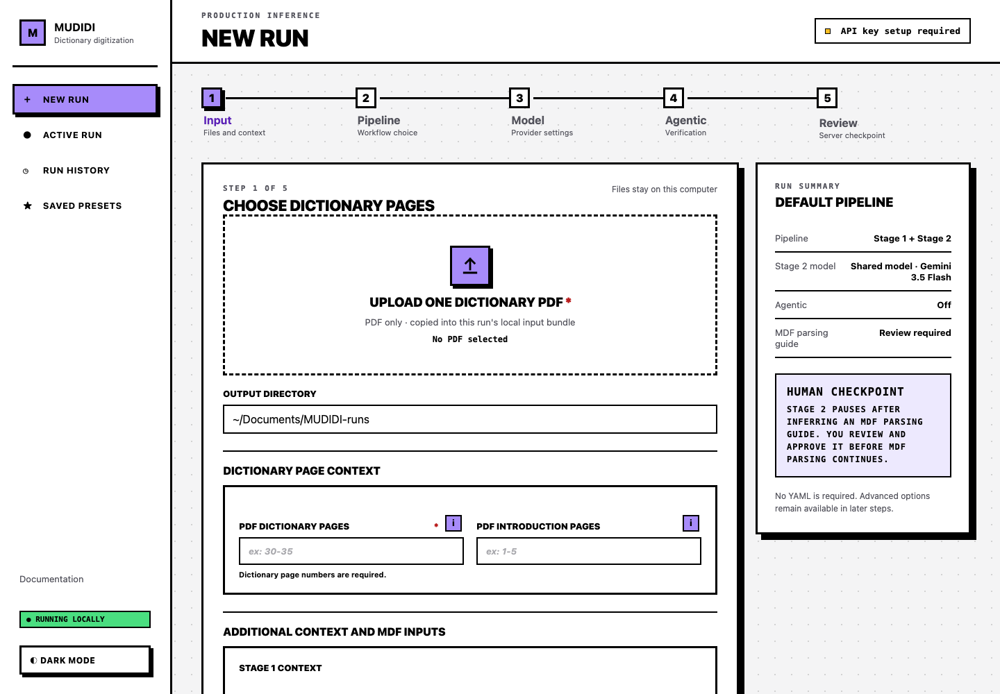
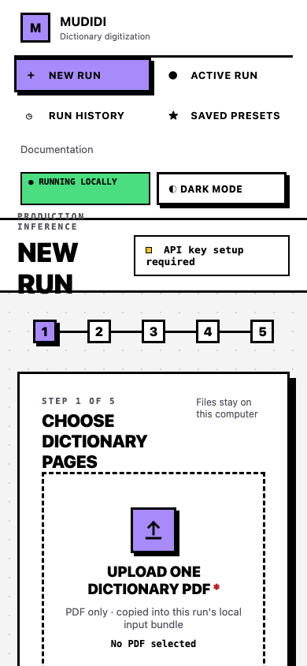

# Local Web Application UX Specification

This document is the source of truth for user-visible dashboard behavior.
Internal database/config keys such as `parse_rules` and routes such as
`/parse-rules` remain unchanged. The canonical generated filename is
`mdf_parsing_guide.json`.

## Application shell

The desktop layout uses a fixed left navigation, compact header, central work
area, and optional right summary rail. This is the shipped New Run interface:



At narrow widths the navigation and wizard controls stack without horizontal
page overflow:



The original planning wireframe remains available at
[`assets/new-run-wireframe.png`](assets/new-run-wireframe.png).

## Input

The browser selects exactly one dictionary PDF. The dashboard rejects page
images, multiple source files, and page-image folders; those input modes remain
available through YAML and the CLI. The existing MDF parsing guide and custom
MDF manual remain optional file uploads. Stage 1 and Stage 2 instructions may
be typed directly or uploaded as TXT, Markdown, or PDF attachments. Uploaded
files are copied into run-owned local storage. The output directory remains
typed because browser file APIs do not provide an arbitrary absolute path to a
localhost server.

The dictionary PDF and **PDF dictionary pages** are required. Page fields accept
positive, 1-based Arabic page numbers in any of these forms: one number (`5`),
one ascending range (`10-20`), comma-separated numbers (`1,5,9`), or a
combination (`1,5,10-20`). Roman numerals, zero, negative values, descending
ranges, and pages beyond the uploaded PDF's page count are rejected.

Introduction pages and representative MDF parsing-guide pages are optional and
use the same grammar and PDF bounds. Representative pages must also be included
in the dictionary-page selection. Placeholder examples use faded text with an
`ex:` prefix (`ex: 30-35`, `ex: 1-5`, and `ex: 30-32`) so they cannot be
mistaken for submitted values.

The browser marks required controls, but the server remains authoritative. A
missing required value or invalid page specification blocks review, returns the
user to the New Run form, opens the affected section, and marks the field in red
with an associated text explanation.

The optional **Dictionary Profile** collects:

- headword language and script;
- target languages and scripts;
- a free-form page-layout description;
- common and custom entry information types.

The whole profile may be left blank.

## Pipeline

Three radio choices are displayed with keyboard/touch-accessible information
help:

| Choice | Internal stage | Meaning |
|---|---|---|
| Complete digitization | `all` | Transcribe, infer/review MDF parsing guide, parse into MDF |
| Transcription only | `1` | Flat faithful transcription only |
| Parse transcription into MDF (Multi-Dictionary Formatter) | `2` | Existing Stage 1 text to reviewed MDF |

Discovery-only and direct Pass 2 are not dashboard choices. Stage 2 always
includes inference or import of an MDF parsing guide and mandatory review.

Dashboard runs always use the two-stage LLM strategy, flat Stage 1 output, and
typography preservation off. OCR hints, Stage 1 column mode, and expert
OCR/VLM/Mathpix controls remain CLI/YAML features.

## Model

Only active-stage model controls are visible. Complete runs show Stage 1, Stage
2 Pass 1, and Stage 2 Pass 2. Transcription shows Stage 1. MDF parsing shows the
two Stage 2 models.

Provider-specific choices combine the bundled catalog, optional live discovery,
and custom LiteLLM identifiers. OpenRouter requires manual model entry and
offers an optional **OpenRouter Provider** routing slug.

## Agentic verification

Agentic verification is an On/Off choice and defaults to Off. Selecting On
opens **Custom verification** directly below it. Applicable Stage 1 and Stage 2
boxes
are initially checked and may be unchecked. The backend intersects these values
with active stages and ignores forged inactive values.

Custom controls cover iterations, minimum confidence, evaluator/rewriter models
and reasoning, deterministic patches, and concrete retry evidence. The UI states
that verification adds model calls and cost.

## Additional instructions

Each active stage presents one instruction source at a time:

1. **Type instructions** uses a bounded multiline UTF-8 text value.
2. **Upload instruction file** accepts exactly one `.txt`, `.md`, or `.pdf`
   attachment.

TXT and Markdown attachments must decode as UTF-8, contain non-blank text, and
stay within the same 20,000-character limit as typed instructions. PDF
attachments remain document or visual context rather than being flattened to
plain text. Their optional page selector uses the dashboard's positive
1-based page/range grammar; blank means every attachment page.

Stage 2 adds a Pass 1, Pass 2, or Both-passes scope. Both is the default.
Changing sources after selecting a file requires confirmation because the
browser cannot retain that file after it is cleared. Review and preset screens
display attachment metadata, while the worker supplies the resolved content to
the selected stage and agentic evaluator/rewriter paths.

## MDF parsing guide and MDF manual

**MDF parsing guide** is the dictionary-specific artifact inferred by Stage 2
Pass 1 or imported from user JSON. **MDF manual** is optional general reference
material.

The MDF manual choices are:

1. Upload my own MDF manual.
2. Open the official SIL MDF documentation in a new browser tab.
3. Continue without an MDF manual.

The help text explains that the relevant MDF section of the official manual is
pages 31–95 (65 pages), and recommends uploading only the marker/tag pages
needed for the dictionary to improve relevance and reduce token cost. When the
user does not know which markers are relevant, it directs them to run Complete
digitization without a manual, inspect the LLM-inferred MDF parsing guide at the
human checkpoint, and then start a new run with only the corresponding manual
pages. MUDIDI does not package or redistribute the SIL manual.

Representative MDF parsing guide pages include help explaining that Stage 2
samples them to infer dictionary-specific MDF markers and entry structure.

## Review

The pre-run view summarizes input, output, pipeline, models, Agentic state,
additional context, MDF manual use, and MDF parsing guide review requirement.
All required inputs, page syntax, and PDF page bounds are validated before a
durable run is created.

## Active Run

```text
Overview | MDF parsing guide | Pages | Live Logs | Outputs | Usage
```

Overview shows progress, current state, recent events, and relevant actions.
Pages and page evidence show source, transcription, verification, and MDF output.

## MDF parsing guide review

The review screen progresses through waiting, inferring, review required, and
approved states. It edits the MDF parsing-guide fields: markers/descriptions,
guide rules, and abbreviations.

Saving is not approval. Approval validates the guide, writes an immutable
snapshot, binds it to the run and review version, records its SHA-256, and only
then authorizes MDF page parsing. Closing the browser or server never implies
approval. This checkpoint applies to LLM-inferred guides. A valid guide that the
user explicitly uploads is copied into managed storage and used directly after
format validation, without showing this review screen.

## Run History and presets

History exposes user-friendly MDF parsing guide status labels while preserving
internal stored status values. Presets copy managed inputs into preset-owned
storage. Preparing a preset clones those files into the new run so neither
depends on the other's lifecycle.

## Accessibility and responsive behavior

- semantic fieldsets, legends, and labels;
- visible focus and keyboard/touch-operable help;
- status conveyed through text rather than color alone;
- errors associated with fields without echoing sensitive values;
- responsive monitoring/review, with desktop recommended for large setup.
